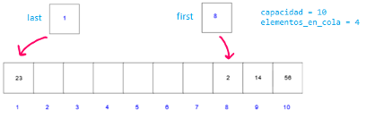

# Ejercicios de Colas

### Información del Proyecto

| Descripción   | Detalles                           |
|---------------|------------------------------------|
| Profesores    | Sergio Cavero y Salvador Sanchez   |
| Asignatura    | Estructuras de Datos               |
| Universidad   | Universidad Rey Juan Carlos        |
| Curso         | 2024/2025                          |


# Tabla de contenidos

- [Ejercicio 1: Uso guiado de la cola](#ejercicio-1-uso-guiado-de-la-cola)
- [Ejercicio 2: Añadir un contador de elementos a la cola](#ejercicio-2-a%C3%B1adir-un-contador-de-elementos-a-la-cola)
- [Ejercicio 3: Imprimir la cola en orden inverso](#ejercicio-3-imprimir-la-cola-en-orden-inverso)
- [Ejercicio 4: Sumar dos colas](#ejercicio-4-sumar-dos-colas)
- [Ejercicio 5: Resolver ejercicios básicos basados en recorrer la cola](#ejercicio-5-resolver-ejercicios-b%C3%A1sicos-basados-en-recorrer-la-cola)
- [Ejercicio 6: Eliminar elementos de la cola si se cumple una condición](#ejercicio-6-eliminar-elementos-de-la-cola-si-se-cumple-una-condici%C3%B3n)
- [Ejercicio 7: Resolución de un problema con colas con tamaño dinámico](#ejercicio-7-resoluci%C3%B3n-de-un-problema-con-colas-con-tama%C3%B1o-din%C3%A1mico)
- [Ejercicio 8: Resolución de un problema con colas con tamaño fijo por medio de un array circular](#ejercicio-8-resoluci%C3%B3n-de-un-problema-con-colas-con-tama%C3%B1o-fijo-por-medio-de-un-array-circular)


# ¿Cómo enfrentarse a los ejercicios?

Antes de comenzar con cada uno de los ejercicios: 

1. Lee detenidamente el enunciado **completo**.
2. Identifica cuál es el objetivo del ejercicio:
    - Identificar el tipo de elementos que se almacenará en la cola: 
        - Ejemplos: enteros, caracteres, registros, etc.
        - Esto va a determinar la definición de los nodos de la cola (o el tipo de array en caso de no ser una cola implementada en memoria dinámica).
    - Extender o modificar funcionalidades de la cola:
        - Ejemplos: contar el número de elementos de la cola, verificar si un elemento está en la cola, eliminar un elemento, etc.
        - Generar nuevos procedimientos o funciones requerirá utilizar las operaciones principales.
        - Es decir, nuevamente deberemos **trabajar en la propia unidad** de la cola ya que estamos extendiendo su funcionalidad. Tendremos el "rol" de implementador de la unidad.
    - Utilizar la cola para resolver un problema específico:
        - Ejemplos: verificar si una expresión aritmética está balanceada, verificar si una palabra es palíndroma, utilizarla para representar un conjunto de elementos, etc.
        - En este caso, deberemos utilizar las operaciones básicas de la unidad de la cola para resolver el problema, no podemos modificar la definición de la cola.
        - Por lo tanto, deberemos **usar** la cola en el programa principal para resolver el problema. Tendremos el rol de usuario externo de la unidad cola y por lo tanto no la podremos modificar.
    
2. Abre cada uno de los archivos proporcionados y estudia el código proporcionado.
3. Haz que el programa compile y ejecútalo aunque de primeras no haga todo lo que se pide.
4. Realiza los ejercicios de manera ordenada, comprobando que cada uno de ellos funciona correctamente antes de pasar al siguiente.


# Organización de los ejercicios
- **Ejercicio 1**: Uso guiado de la cola.
    - Objetivos: interactuar con la cola, añadir, eliminar, mostrar y consultar elementos.
    - Rol: Usuario de la unidad de la cola.
    - Dificultad: Muy baja
- **Ejercicio 2**: Añadir un contador de elementos a la cola.
    - Objetivos: extender la unidad mediante la modificación de la definición de la cola
    - Rol: Implementador de la unidad.
    - Difficultad: Baja
- **Ejercicio 3**: Imprimir la cola en orden inverso.
    - Objetivos: hacer uso de la cola para resolver un problema específico.
    - Rol: Usuario de la unidad de la cola.
    - Dificultad: Media
- **Ejercicio 4:**: Sumar dos colas.
    - Objetivos: hacer uso de la cola para resolver un problema específico.
    - Rol: Usuario de la unidad de la cola.
    - Dificultad: Bajo-Media
- **Ejercicio 5**: Resolver ejercicios básicos basados en recorrer la cola.
    - Objetivos: hacer uso de la cola para resolver un problema específico.
    - Rol: No indicado
    - Dificultad: Baja-Media
- **Ejercicio 6:**: Eliminar elementos de la cola si se cumple una condición.
    - Objetivos: hacer uso de la cola para resolver un problema específico, modificar la definición de la cola y hacer uso de registros.
    - Rol: No indicado
    - Dificultad: Media
- **Ejercicio 7:**:  Implementación de un nuevo TAD cola y resolución de un problema que emplea dicho TAD.
    - Objetivos: hacer uso de la cola para resolver un problema específico.
    - Rol: Ambos.
    - Dificultad: Alta
- **Ejercicio 8:**: Implementación de un nuevo TAD cola.
    - Objetivos: hacer uso de la cola para resolver un problema específico.
    - Rol: Implementador de la cola.
    - Dificultad: Alta

# Ejercicio 1: Uso guiado de la cola

En este ejercicio, trabajaremos con operaciones básicas de colas. Para realizar este ejercicio se proporcionan los siguientes ficheros:

- `uColaInteger.pas`
- `cola_ej1.pas`

## Ejercicio 1.1: Revisa la implementación de la cola
Abre el archivo `uColaInteger.pas` y repasa la implementación de la cola. ¿Cuál es el tipo de los elementos que se almacenan en la cola? ¿Qué operaciones básicas se pueden realizar con la cola?

## Ejercicio 1.2: Crear una cola, añadir elementos y mostrar la cola
Abre el archivo `cola_ej1.pas` y completa el programa para que realice las siguientes acciones:
1. Crear una cola.
2. Añadir los elementos 1, 2, 3, 4 y 5 a la cola.
3. Mostrar los elementos de la cola.

El programa deberá mostrar los elementos de la cola en el siguiente formato:

```plaintext
[1, 2, 3, 4, 5]
```

## Ejercicio 1.3: Trabajar con el primer y último elemento de la cola
Completa el programa para que realice las siguientes acciones:
1. Mostrar el primer elemento de la cola.
2. Mostrar el último elemento de la cola.
3. Mostrar la diferencia entre el primer y el último elemento de la cola (primero - último).

El programa deberá mostrar los elementos de la cola en el siguiente formato:

```plaintext
Primer elemento: 1
Último elemento: 5
Diferencia: -4
```

## Ejercicio 1.4: Eliminar elementos de la cola
Completa el programa para que realice las siguientes acciones:

1. Muestra el número de elementos de la cola.
2. Eliminar el primer elemento de la cola.
3. Muestra los elementos de la cola.
4. Muestra el número de elementos de la cola.
5. Elimina todos los elementos de la cola.
6. Muestra los elementos de la cola.
7. Muestra el número de elementos de la cola.

El programa deberá mostrar los elementos de la cola en el siguiente formato:

```plaintext
Número de elementos de la cola: 5
[2, 3, 4, 5]
Número de elementos de la cola: 4
[]
Número de elementos de la cola: 0
```

## Ejercicio 1.5: Consultar si la cola está vacía

Completa el programa para que realice las siguientes acciones:

1. Consultar si la cola está vacía.
2. Añadir el elemento 1 a la cola.
3. Consultar si la cola está vacía.

El programa deberá mostrar los elementos de la cola en el siguiente formato:

```plaintext
La cola está vacía
La cola no está vacía
```


# Ejercicio 2: Añadir un contador de elementos a la cola

En este ejercicio, trabajaremos con la definición de la cola. Para realizar este ejercicio se proporcionan los siguientes ficheros:

- `uColaIntegerMod.pas`
- `cola_ej2.pas`

El fichero `uColaIntegerMod.pas` es identico al fichero `uColaInteger.pas` del ejercicio anterior, pero con un nombre diferente. Se proporciona para que puedas trabajar en paralelo con ambos ejercicios y comparar las soluciones.

El objetivo de este ejercicio es optimizar la función `num_elems` para que devuelva el número de elementos de la cola en tiempo constante (O(1)). Para ello, deberás añadir un contador de elementos a la cola.

## Ejercicio 2.1: Modificar la definición de la cola

Abre el archivo `uColaIntegerMod.pas` y modifica la definición de la cola para añadir un contador de elementos.

## Ejercicio 2.2: Modificar funciones y procedimientos

Modifica todas aquellas funciones y procedimientos que añadan o eliminen elementos de la cola para que actualicen el contador de elementos.

## Ejercicio 2.3: Implementar la función `num_elems`

Completa la función `num_elems` para que devuelva el número de elementos de la cola en tiempo constante (O(1)).

## Ejercicio 2.4: Comprobar el correcto funcionamiento

Localiza y abre el archivo `cola_ej2.pas`. Este programa tiene como objetivo demostrar la correcta implementación de la nueva unidad y medir la eficiencia de la función `num_elems` antes y después de una modificación. **No es necesario modificar este archivo**.

El programa realiza las siguientes acciones:

1. **Probar Ejercicio**:
    - Inicializa dos colas, una utilizando la unidad `uColaInteger` y otra utilizando la unidad `uColaIntegerMod`.
    - Encola 10 elementos en ambas colas y muestra su contenido.
    - Verifica si los tamaños de ambas colas coinciden.
    - Desencola 5 elementos de ambas colas y muestra su contenido nuevamente.
    - Verifica nuevamente si los tamaños de ambas colas coinciden.
    - Limpia ambas colas y muestra su contenido final.

2. **Analizar Tiempo**:
    - Inicializa dos colas, una utilizando el módulo `uColaInteger` y otra utilizando el módulo `uColaIntegerMod`.
    - Encola 100,000 elementos en ambas colas.
    - Mide y muestra el tiempo que tarda la función `num_elems` en ejecutarse para ambas colas. Te recomendamos utilizar la unidad [DateUtils](https://www.freepascal.org/docs-html/rtl/dateutils/index-5.html) de Pascal para ello.

El programa permite comparar la eficiencia de la implementación original de la cola con la implementación modificada, especialmente en términos de tiempo de ejecución de la función `num_elems`. 
Ahora, razona: 
- ¿Te esperabas los resultados obtenidos?
- ¿Cuál es el máximo número de elementos que puedes encolar en la cola antes de que la función `num_elems` sea más lenta en la implementación original?
- ¿Cuál es el número de elementos que tienes que meter para que la función `num_elems` tarde más de 10 segundos en la implementación original?


# Ejercicio 3: Imprimir la cola en orden inverso

En este ejercicio trabajaremos con operaciones básicas de colas. Para este ejercicio se proporcionan los siguientes ficheros:

- `uColaInteger.pas`
- `cola_ej3.pas`

Se pide imprimir los elementos de la cola en orden inverso. Para ello, deberás implementar un subprograma que reciba una cola y muestre los elementos de la cola en orden inverso. 
No se permite modificar la unidadd de la cola: unicamente se pueden usar las operaciones básicas de la cola. 

Consejo: utilizando una pila puede que te resulte más sencillo resolver el problema: tienes a tu disposición la unidad `uPilaInteger.pas` en esta misma carpeta.

## Condiciones

- La cola debe mantener su contenido y orden original.
- Complejidad de tiempo esperada: O(n)
- Complejidad de espacio auxiliar esperada:
    - O(1): ¡Increíble! No se necesita espacio adicional para resolver este problema.
    - O(n): Muy bien, aunque se puede mejorar.
    - Superior a O(n): ¡Vaya! ¿No crees que se puede hacer mejor?

## Entradas

- Cola de enteros

## Salida

- Mostrar los elementos de la cola en orden inverso.

## Ejemplo

- (cola: [1, 2, 3, 4, 5]) => [5, 4, 3, 2, 1]


# Ejercicio 4: Sumar dos colas

En este ejercicio, trabajaremos con operaciones básicas de colas. Para realizar este ejercicio se proporcionan los siguientes ficheros:

- `uColaInteger.pas`
- `cola_ej4.pas`

## Ejercicio 4.1: Sumar dos colas de igual tamaño

Desarrollar un subprograma que reciba dos colas de enteros (con el mismo número de elementos) y devuelva una nueva cola con la suma de los elementos de las colas originales.

## Entradas: 
- Dos colas de enteros

## Salida: 
- Una cola de enteros con la suma de los elementos de las colas originales

## Ejemplos: 
- (cola1: [1, 2, 3], cola2: [4, 5, 6]) => [5, 7, 9]
- (cola1: [1, 2], cola2: [4, 5]) => [5, 7]

## Ejercicio 4.2: Sumar dos colas, independientemente de su tamaño

### Descripción

Desarrollar un subprograma que reciba dos colas de enteros y devuelva una nueva cola con la suma de los elementos de las colas originales. Si el número de elementos no es el mismo, por ejemplo la cola1 tiene más elementos que la cola2, entonces una vez sumada la parte común se copiará en la cola resultado el resto de elementos de la cola 1.

### Entradas
- Dos colas de enteros

### Salida
- Una cola de enteros con la suma de los elementos de las colas originales

### Ejemplos
- (cola1: [1, 2, 3], cola2: [4, 5, 6]) => [5, 7, 9]
- (cola1: [1, 2, 3], cola2: [4, 5]) => [5, 7, 3]
- (cola1: [1, 2], cola2: [4, 5, 6]) => [5, 7, 6]


# Ejercicio 5: Resolver ejercicios básicos basados en recorrer la cola

En este ejercicio, trabajaremos con operaciones básicas de colas, pero esta vez nos enfocaremos en resolver problemas específicos que requieren recorrer la cola. Para realizar este ejercicio se proporcionan los siguientes ficheros:

- `uColaInteger.pas`
- `cola_ej5.pas`

## Condiciones
- La cola debe mantener su contenido y orden original.
- Complejidad de tiempo esperada: O(n)
- Complejidad de espacio auxiliar esperada:
    - O(1): ¡Increíble! No se necesita espacio adicional para resolver este problema.
    - O(n): Muy bien, aunque se puede mejorar.
    - Superior a O(n): ¡Vaya! ¿No crees que se puede hacer mejor?

## Ejercicio 5.1: Comprobar si un número está en la cola

### Descripción
Desarrollar un subprograma que reciba una cola y un número entero y devuelva verdadero si el número está en la cola y falso en caso contrario.

### Entradas
- Cola de enteros
- Número entero

### Salida
- Booleano: Verdadero si el número está en la cola, falso en caso contrario.

### Ejemplos
- (cola: [1, 2, 3, 4, 5], n: 3) => true
- (cola: [1, 2, 3, 4, 5], n: 6) => false

## Ejercicio 5.2: Comprobar si un número está en la cola y devolver su posición

### Descripción
A partir del subprograma anterior, desarrollar un nuevo subprograma que reciba una cola y un número entero y devuelva la posición del número en la cola. Devolver -1 si el número no está en la cola.

### Entradas
- Cola de enteros
- Número entero

### Salida
- Entero: Posición del número en la cola. Devolver -1 si el número no está en la cola. La posición de un elemento en la cola se cuenta desde 1.

### Ejemplos
- (cola: [1, 2, 3, 4, 5], n: 3) => 3
- (cola: [1, 2, 3, 4, 5], n: 1) => 1
- (cola: [1, 2, 3, 4, 5], n: 6) => -1

## Ejercicio 5.3: Determinar si la cola está ordenada

### Descripción
Desarrollar un subprograma que reciba una cola de enteros y devuelva 1 si la cola está ordenada de forma creciente, -1 si está ordenada de forma decreciente y 0 si no está ordenada.

### Entradas
- Cola de enteros

### Salida
- Entero: 1 si la cola está ordenada de forma creciente, -1 si está ordenada de forma decreciente y 0 si no está ordenada. En caso de una cola vacía o con un solo elemento, devolver 0.

### Ejemplos
- (cola: [1, 2, 3, 4, 5]) => 1
- (cola: [5, 4, 3, 2, 1]) => -1
- (cola: [1, 3, 2, 4, 5]) => 0
- (cola: [1]) => 0


# Ejercicio 6: Eliminar elementos de la cola si se cumple una condición

En este ejercicio, trabajaremos con operaciones básicas de colas, pero esta vez nos enfocaremos en resolver problemas específicos que requieren recorrer la cola. Para realizar este ejercicio se proporciona el siguiente fichero:

- `uColaClientes.pas`
- `cola_ej6.pas`

El fichero `uColaClientes.pas` es la cola de enteros que se ha utilizado en los ejercicios anteriores, pero con un nombre diferente. El objetivo es modificar la definición de esta cola para poder resolver el problema propuesto.

Por otro lado, el fichero `cola_ej6.pas` es el programa principal que se encargará de probar la implementación de la cola.

## Ejercicio 6.1: Modificar la definición de la cola

Abre el archivo `uColaClientes.pas` y modifica la definición de la cola para que pueda almacenar "clientes". 
Un cliente puede ser definido como un registro con los siguientes campos: codigo (entero) y activo (booleano). El campo código representa el código del cliente y el campo activo indica si el cliente está activo o no.

Modifica todas las funciones y procedimientos que añadan o eliminen elementos de la cola para que se adapten a la nueva definición de la cola.

Nota: existen múltiples formas de implementar esta modificación, en clases anteriores se planteo una posibilidad a partir de la unidad `TElemento`, pero no es la única forma de hacerlo. Si bien se podría hacer sin un registro, guardando directamente el código y el nombre en el nodo, recomendamos utilizar un registro para facilitar la comprensión del código.

En este ejercicio estás tomando el rol de **desarrollador de la unidad**.

Modifica el método toString para que muestre los clientes de la cola. 

## Ejercicio 6.2: Comprueba que la cola se han implementado correctamente

En el fichero `cola_ej6.pas`, implementa un procedimiento que inicialice la cola, es decir, que añada varios clientes a la cola. A continuación, muestra los clientes de la cola.

1. Crear una cola de clientes.
2. Añadir varios clientes a la cola.
3. Muestra los clientes de la cola.

En este ejercicio estás tomando el rol de **usuario externo de la unidad**, ya que estás utilizando la cola y sus métodos sin modificar la definición de la cola.

## Ejercicio 6.3: Eliminar clientes de la cola si no están activos

Desarrolla un procedimiento en el fichero `cola_ej5.pas` que reciba una cola de clientes y elimine todos los clientes que no están activos.

Al igual que en el ejercicio anterior, en este ejercicio estás tomando el rol de **usuario externo de la unidad**.

## Ejercicio 6.4: Comprueba que la cola se ha implementado correctamente

Observa el método `test_eliminar_clientes_inactivos` en el fichero `cola_ej6.pas`. Este método prueba la implementación del procedimiento que has desarrollado en el ejercicio anterior.

# Ejercicio 7: Resolución de un problema con colas con tamaño dinámico

Para este ejercicio, se proporciona un enunciado más complejo que requiere la implementación de una cola especializada. Para realizar este ejercicio no se proporcionan ficheros de código, por lo que deberás crearlos desde cero.

1.	Implementa un TAD ColaTransaccionesBitcoin que implemente las 5 funcionalidades básicas de una Cola (enqueue, dequeue, is_empty, first, last) además de initialize utilizando como elemento base de la cola un registro de tipo TransaccionBitcoin, cuyos campos serán id_transaccion (un entero), fee (la comisión para el minero en Satoshis/byte, un entero positivo), direcciones origen y destino de la transacción (cada una un string de 50), prioridad (un entero entre 0 y 3) y valor transferido en bitcoins (un número real).

2.	Añade al TAD ColaTransaccionesBitcoin una función “modificar_prioridad” que tenga como argumentos una Cola de transacciones y dos valores de prioridad: p_nueva y p_vieja, de forma que modifique la prioridad de todas las transacciones que tengan valos p_vieja poniéndolos a prioridad p_nueva. Si no hay ninguna transacción con p_vieja la cola quedaría intacta.

3.	Implementa ahora la misma función anterior, pero desde la perspectiva de un usuario de la cola, es decir, solo puedes utilizar las funciones básicas del TAD ColaTransaccionesBitcoin y lógicamente también modificar la prioridad de una transacción. 

4.	Añade al TAD un subprograma EliminarTransferenciasDuplicadas que analice una cola y elimine posible transacciones duplicadas. Se sabrá que están duplicadas cuando la dirección origen y destino y el importe a transferir coincidan, a pesar de que la fee y el id_transacción podrían ser distintos. 

5.	Añade al TAD un subprograma que permita sacar de la cola todas las transacciones cuyo fee sea menor de un cierto importe en satoshis/byte que se pasa como parámetro.

6.	Implementa el subprograma anterior desde la perspectiva de un usuario de la cola, lo que como sabes te obliga a utilizar únicamente las funciones básicas del TAD. 

# Ejercicio 8: Resolución de un problema con colas con tamaño fijo (por medio de un array circular)

Implementa una cola de Transferencias Bitcoin sobre un array circular de transferencias, con todas sus funcionalidades básicas más clear (vacía toda la cola) y is_full (indica si se ha llegado al límite de capacidad del array). Recuerda el funcionamiento de una cola con un array circular:

- La inserción es simple: avanzar el índice last a la siguiente posición y almacenar el dato: new_last = (last mod 10) + 1
- La eliminación no reorganiza: simplemente se avanza first a la siguiente posición: new_first = (first mod 10) + 1
- El array se diseña para continuar insertando en el hueco que queda entre first y last 
- Para saber si la cola está vacía la implementación más sencilla es un entero elementos_en_cola: si cero -> vacía.
- Cola llena: si elementos_en_cola es igual a la capacidad.



